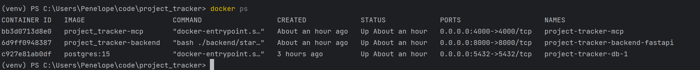
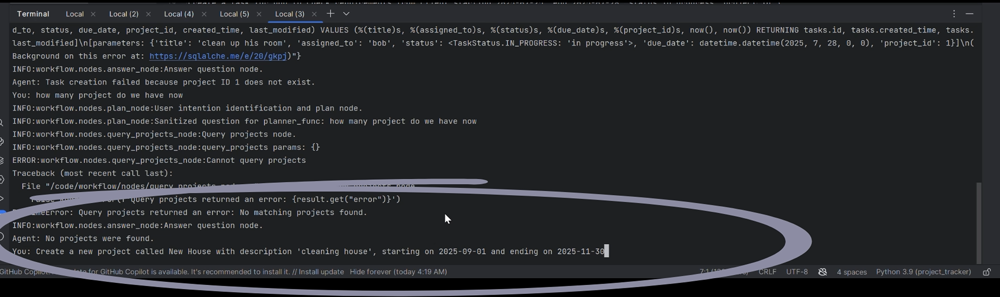

# Project Setup & Usage

## Prerequisites

- [Docker](https://www.docker.com/get-started) & [Docker Compose](https://docs.docker.com/compose/install/)

---

## Getting Started

### 1. **Build the Docker Containers**
```bash
docker compose build
```

### 2. **Start the Containers**
```bash
docker compose up
```

This will launch all three containers:
- **project-tracker-db-1**  
  _PostgreSQL database_
- **project-tracker-backend-fastapi**  
  _Backend API and agentic workflow_
- **project-tracker-mcp**  
  _MCP server_


### 3. **Access the FastAPI Database CRUD**
Open your browser and go to:
http://localhost:8000/docs#/

Here you can interact with all FastAPI endpoints using the Swagger UI.

### 4. **Test Out all pytest**
To run all the test cases, follow these steps:

1. **Open a shell inside the running backend container:**
   ```bash
   docker exec -it project-tracker-backend-fastapi sh
   ```
2. **Run the workflow:**
```bash
pytest -vv -s --show-capture=all
```

### 5. **Test Out the Agentic Workflow**
To run the agentic workflow, follow these steps:

1. **Open a shell inside the running backend container:**
   ```bash
   docker exec -it project-tracker-backend-fastapi sh
   ```
2. **Run the workflow:**
```bash
python -m workflow.cli
```
[](..%2F..%2FDownloads%2Fexample.mp4)


## 6. **Architecture Overview**

This project implements an agentic workflow system integrating multiple components to manage projects and tasks efficiently. The core architecture is designed for scalability, observability, and smooth user interaction.

---

### Key Components

#### 1. Workflow Nodes

- **Orange Boxes (LLM Nodes):**  
  These nodes use large language models (LLMs) to perform tasks such as planning, clarifying intent, analyzing, and producing the final answer.  
  _Example nodes:_ `Plan`, `Clarify`, `Analyze After Check`, `Final Answer`.

- **Purple Boxes (Database Query Nodes):**  
  These nodes query the PostgreSQL database to fetch existing project and task data, enabling the workflow to make informed decisions.  
  _Example nodes:_ `Query Tasks`, `Query Projects`, `Check Project Exist`, `Check Task Exist`.

- **Pink Boxes (Database Create Nodes):**  
  Nodes responsible for creating new entries in the database, such as adding projects or tasks.  
  _Example nodes:_ `Create Project`, `Create Task`.

---

### Data and Context Management

- **In-Memory Context Management (Langchain InMemory):**  
  - For development and testing, conversation context is managed using Langchain's **InMemory vector store**, which temporarily holds session states and embeddings. This allows the agent to maintain context across multiple user inputs within the same conversation.
  - This is especially important for nodes like the **Clarify** node, where the user may need to provide additional information or partial input. Using in-memory context ensures that the agent does not lose track of previous context when the user inputs are incomplete or spread over multiple interactions.

- **Redis (Production):**  
  In production environments, Redis is recommended to manage conversation context for persistence, scalability, and fast access.

---

### Backend and Data Persistence

- **PostgreSQL:**  
  Serves as the primary relational database storing `Project` and `Task` entities, queried and updated by workflow nodes.

- **FastAPI Backend:**  
  Hosts the REST API, interacts with the MCP Server, PostgreSQL database, and message broker for background jobs.

- **MCP Server:**  
  Acts as the orchestrator for tool calls, mediating between the LLMs, database queries, and external APIs.

---

### Background Processing & Monitoring (Production Considerations)

- **Message Broker & Background Jobs:**  
  - Triggered on project/task creation, update, or deletion to send notification emails (e.g., SMTP server integration).  
  - Batch jobs archive projects/tasks that are complete or expired for more than two years.  
  - Periodic summary jobs (weekly/monthly) generate reports on projects/tasks.

- **Monitoring with DataDog:**
  - Logs and metrics such as error rates, latency, request counts, and throughput are sent to DataDog for real-time monitoring and alerting. 
  - The performance of the LLM agent can also be monitored by user satisfaction rates in terms of answer quality (frontend development for interaction is required) and user retention rate. 
  - Additionally, smaller models can be employed to evaluate relevance and assist with continuous quality assessment.

---

### User Interaction

Users interact with the system primarily through the **agentic workflow** interface, which processes intents, queries, and updates tasks/projects accordingly.

---

### Summary Flow

1. User input triggers the **Workflow**.  
2. Workflow nodes perform planning and clarifying with LLM tools.  
3. Database query nodes check existing data in PostgreSQL.  
4. Based on checks, creation nodes add new projects or tasks.  
5. Final answers are composed and returned to the user.  
6. Context is managed in-memory during development and Redis in production.  
7. All operations generate logs monitored by DataDog.  
8. Background jobs handle asynchronous email notifications and archiving.


## 7. Project Structure

```plaintext
.
├── backend/
│   ├── database_api/
│   │   ├── core/
│   │   ├── db/
│   │   ├── enum/
│   │   ├── routers/
│   │   ├── schemas/
│   │   ├── services/
│   │   ├── __init__.py
│   │   └── main.py
│   ├── tests/
│   ├── __init__.py
│   ├── Dockerfile
│   └── start.sh
├── mcp-server/
│   ├── src/
│   │   ├── handlers/
│   │   ├── utils/
│   │   └── server.ts
│   ├── Dockerfile
│   ├── package.json
│   └── tsconfig.json
├── workflow/
│   ├── nodes/
│   │   ├── __init__.py
│   │   ├── node_1.py
│   │   ├── node_2.py
│   │   ├── node_3.py
│   │   ├── ...
│   ├── agent_context.py
│   ├── agent_state.py
│   ├── agent_workflow.py
│   ├── cli.py
│   ├── guardrail.py
│   ├── setup_mcp.py
│   └── utils.py
├── .env
├── .gitignore
├── .pre-commit-config.yaml
└── docker-compose.yaml
